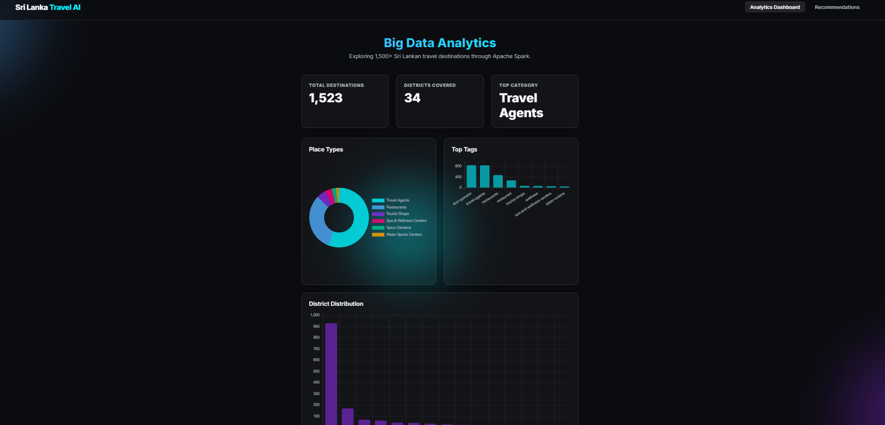
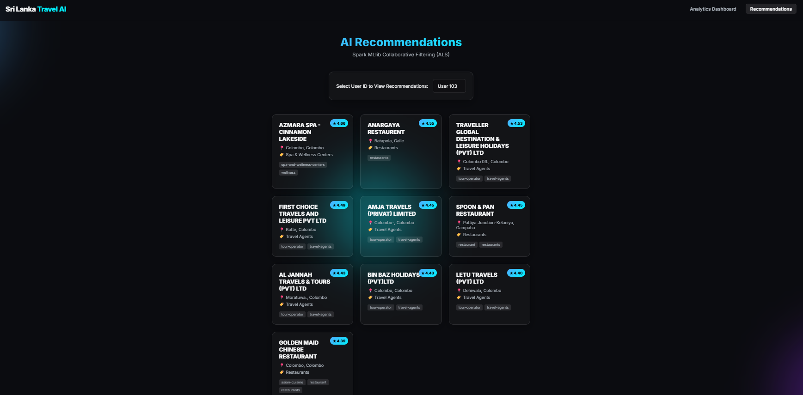

# Sri Lankan Travel Analytics & Recommendations

A Big Data Analytics mini-project that explores ~1,500 Sri Lankan travel,
dining, and recreational destinations using **Apache Spark (PySpark)** for
the analytics pipeline, a **Flask** backend that serves both the REST API
and the web dashboard, and a **modern glassmorphic frontend** built with
vanilla JS + Chart.js.

The project is split into the two parts required by the assignment:

| Part   | Theme                                    | Spark component used        |
| ------ | ---------------------------------------- | --------------------------- |
| Part A | Exploratory analytics + K-Means clusters | Spark SQL + Spark MLlib     |
| Part B | Personalised place recommendations       | Spark MLlib (ALS)           |

---

## Dataset

- **Source file:** `Places for Travel-Dining-Recreational activities and Information of travel agents.csv`
- **Records:** ~1,500 places across all districts of Sri Lanka
- **Fields used:** `Type`, `Name`, `Address`, `Grade`, `District`, `AGA Division`, `PS/MC/UC`

Because the raw dataset only contains *place metadata* (no users, no
ratings), the `data_prep.py` script **synthesizes**:

- **300 users** with a random `home_district` and 2 `preferred_types`
- **~5,000 ratings** biased toward each user's preferred types, home
  district, and Grade-A places

This makes the ALS recommender in Part B trainable while keeping the
analytical base in Part A grounded in real data. The synthesis is fully
deterministic (`seed=42`).

---

## Architecture

```
            ┌──────────────────────┐
  raw CSV → │  data_prep.py        │ → places_clean.csv, users.csv, ratings.csv
            └──────────────────────┘
                       │
        ┌──────────────┴───────────────┐
        ▼                              ▼
┌──────────────────┐          ┌────────────────────────┐
│ part_a_analytics │          │ part_b_recommendation  │
│  (Spark SQL +    │          │   (Spark MLlib ALS)    │
│   K-Means)       │          │                        │
└──────────────────┘          └────────────────────────┘
        │                              │
        ▼                              ▼
  analytics.json               recommendations.json
                  (in outputs/)
                       │
                       ▼
        ┌─────────────────────────────┐
        │   Flask backend (app.py)    │
        │   • serves index.html       │
        │   • exposes REST API        │
        └─────────────────────────────┘
                       │
                       ▼
              Frontend Dashboard
              (Chart.js + cards)
```

The application has three layers:

1. **Spark pipeline (offline)** — three Python scripts that clean the
   raw CSV, run analytics, train the recommender, and write JSON
   artefacts into `outputs/`. This stage is run once.
2. **Flask backend (`app.py`)** — serves the frontend and exposes a
   REST API over the JSON artefacts. This is the single process you
   run to use the application.
3. **Frontend dashboard (`frontend/`)** — vanilla HTML/CSS/JS +
   Chart.js, served by Flask at `/`.

### Part A — Analytics (`part_a_analytics.py`)

Produces `outputs/analytics.json` with:

- **Type distribution** — counts per place type (Restaurants, Hotels, …)
- **District distribution** — top 15 districts by number of places
- **Grade distribution** — A / B / C / Unrated mix
- **Grade-by-Type** — how grades are spread across categories
- **Tag frequency** — top text tags derived from the place names
- **District summary** — total places, dominant type, Grade-A count per district
- **K-Means clusters** — districts grouped by their tourism profile (k = 4),
  each labelled by its dominant type (e.g. *Restaurants-heavy*)

### Part B — Recommendations (`part_b_recommendation.py`)

Trains an **ALS Collaborative Filtering** model on the synthetic ratings
(`maxIter=10`, `regParam=0.1`, `coldStartStrategy="drop"`), then
pre-computes the **top 10 recommendations for every user** and joins each
recommendation back to the place metadata before writing
`outputs/recommendations.json`.

### Backend (`app.py`)

A Flask service that serves the frontend at `/` and exposes a REST API
over the pre-computed JSON artefacts:

| Route                              | Purpose                                  |
| ---------------------------------- | ---------------------------------------- |
| `GET /`                            | Serves the frontend (`index.html`)       |
| `GET /api/analytics`               | Returns the full Part A analytics JSON   |
| `GET /api/users`                   | Returns the list of available user IDs   |
| `GET /api/recommendations/<user>`  | Returns the top-10 recs for a given user |

### Frontend

- **Analytics Dashboard** — KPI cards + Chart.js charts (place types
  doughnut, top tags bar, district distribution bar).
- **Recommendations** — user-ID dropdown that renders the user's top-10
  recommended places as glassmorphic cards with predicted ratings.

---

## Tech Stack

- **Python 3.10+**
- **Apache Spark / PySpark 3.5+** — core analytics + MLlib
- **Pandas / NumPy** — driver-side aggregation
- **Flask + Flask-CORS** — REST API and static file server
- **HTML / CSS / Vanilla JS + Chart.js** — frontend
- **Java 17 (OpenJDK)** — required by Spark on Windows

---

## Setup

### 1. Prerequisites

- Python **3.10 or newer**
- **Java 17 JDK** (OpenJDK / Microsoft Build of OpenJDK works fine)
- `JAVA_HOME` pointed at the JDK install path

> On Windows, `backend/spark_env.py` already falls back to
> `C:\Program Files\Microsoft\jdk-17.0.18.8-hotspot` if `JAVA_HOME` isn't
> set. Update the path in that file if your JDK lives elsewhere.

### 2. Install Python dependencies

```powershell
python -m venv venv
venv\Scripts\activate
pip install -r requirements.txt
```

`requirements.txt`:

```
pyspark>=3.5
pandas>=2.0
numpy>=1.26
flask>=3.0
flask-cors>=4.0
```

---

## Running the Project

The project runs in **two stages**: first generate the data artefacts
with the Spark pipeline (one-time setup), then start the Flask backend
which hosts the dashboard.

### Stage 1 — Generate the data artefacts (Spark pipeline)

Run the three pipeline scripts from the `backend/` folder. Each stage
writes its outputs to disk, so subsequent stages just read from
`data/` or `outputs/`.

```powershell
cd D:\BDA_Assignment\backend

# 1. Clean the raw CSV + synthesize users & ratings
python data_prep.py

# 2. Part A analytics + K-Means clustering
python part_a_analytics.py

# 3. Part B ALS recommendation model
python part_b_recommendation.py
```

After this you should have:

```
data\places_clean.csv
data\users.csv
data\ratings.csv
outputs\analytics.json
outputs\recommendations.json
```

> The repository already ships with these pre-generated artefacts, so
> you can skip Stage 1 the first time and go straight to Stage 2.

### Stage 2 — Start the Flask backend (serves the dashboard)

From the `backend/` folder:

```powershell
cd D:\BDA_Assignment\backend

python app.py
```

Flask will start on **http://localhost:5000**. It serves the dashboard
from `/` and exposes the REST API under `/api/...`.

Open in your browser:

```
http://localhost:5000
```

That's it — the Analytics tab and Recommendations tab will both be
available.

---

## API Examples

```bash
# Analytics payload
curl http://localhost:5000/api/analytics

# Available user IDs
curl http://localhost:5000/api/users

# Top-10 recommendations for user 42
curl http://localhost:5000/api/recommendations/42
```

---

## Key Design Notes

- **Spark-first transformations.** All grouping, pivoting, joining, and
  ML training happens in Spark. Only the small final aggregates are
  pulled to the driver (`.toPandas()`) for JSON serialisation.
- **Pre-computed artefacts.** Spark only runs during the offline
  pipeline (Stage 1). At runtime the Flask backend just reads
  pre-computed JSON files, so the web tier has no runtime Spark
  dependency and responses are fast.
- **Reproducible synthesis.** Users and ratings are generated with a
  fixed seed (`42`) so analytics and recommendations are reproducible
  across machines.
- **Windows-friendly Spark.** `spark_env.py` centralises the
  `JAVA_HOME` / `PYSPARK_PYTHON` setup that PySpark needs on Windows
  to spawn worker processes correctly.

---

## Troubleshooting

| Problem                                       | Fix                                                                                          |
| --------------------------------------------- | -------------------------------------------------------------------------------------------- |
| `JAVA_HOME is not set` / Spark fails to start | Install JDK 17 and either set `JAVA_HOME` or update the path in `backend/spark_env.py`.      |
| `CreateProcess error=2` on Windows workers    | Make sure the same Python interpreter that runs the script is on `PATH` — `spark_env.py` already exports `PYSPARK_PYTHON` automatically. |
| Frontend shows empty charts                   | Run `data_prep.py` and `part_a_analytics.py` first so `outputs/analytics.json` exists.       |
| Recommendations dropdown is empty             | Run `part_b_recommendation.py` so `outputs/recommendations.json` exists.                     |
| Port `5000` already in use                    | Stop the other process or change `app.run(debug=True, port=5000)` in `backend/app.py`.       |

---

## Deliverables

- `outputs/analytics.json` — Part A analytical results
- `outputs/recommendations.json` — Part B per-user top-10 recommendations
- `frontend/` — interactive dashboard
- `slides/` — presentation deck

---

## Dashboard Overview



---
